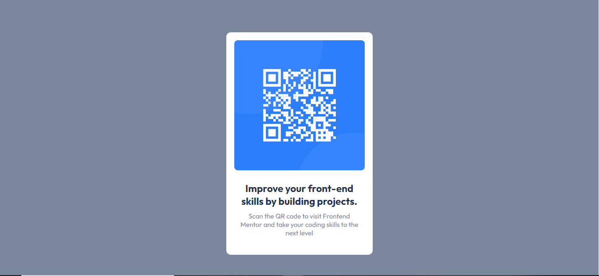

# Frontend Mentor - QR code component solution

This is a solution to the [QR code component challenge on Frontend Mentor](https://www.frontendmentor.io/challenges/qr-code-component-iux_sIO_H). Frontend Mentor challenges help you improve your coding skills by building realistic projects. 

## Table of contents

- [Overview](#overview)
  - [Screenshot](#screenshot)
  - [Links](#links)
- [My process](#my-process)
  - [Built with](#built-with)
  - [What I learned](#what-i-learned)
  - [Continued development](#continued-development)
  - [Useful resources](#useful-resources)
- [Author](#author)
- [Acknowledgments](#acknowledgments)

**Note: Delete this note and update the table of contents based on what sections you keep.**

## Overview

### Screenshot




### Links

- Solution URL: https://github.com/Dk-ninja/Qr-code-component
- Live Site URL: https://github.com/Dk-ninja/Qr-code-component

## My process

### Built with

- Semantic HTML5 markup
- CSS custom properties


### What I learned
1;Div centering
2.Flexbox attributes
3.Responsive

### Links


To see how you can add code snippets, see below:

```html
<body>
<div class="container">
  <div class="card">
    
    <div class="text">
      <h2>Improve your front-end skills by building projects.</h2>
      <p>Scan the QR code to visit Frontend Mentor and take your coding skills to the next level</p>
    </div>
  </div>
</div>
</body>
```css
l('https://fonts.googleapis.com/css2?family=Outfit:wght@400;700&display=swap');

*{
    margin: 0;
    padding: 0;
}
body{
    font-family: 'Outfit', sans-serif;
    background-color: hsl(220, 15%, 55%);
    min-height: 100vh;
    display: grid;
    align-items: center;
    font-size: 15px;
    margin: 15px 0;
}

.container{
    max-width: 360px;
    margin: 0 auto;
}
.card{
    background-color: hsl(0, 0%, 100%);
    padding: 18px;
    border-radius: 10px;
    text-align: center;
    margin: 0 1em;
}
.card img{
    width: 100%;
    border-radius: 8px;

}
.text{
    padding: 22px 10px;
}
.text h2{
    color: hsl(218, 44%, 22%);
    padding-bottom: 10px;
}
.text p{
    color:  hsl(220, 15%, 55%);
}

.attribution{
    margin: 15px;
}
```


### Useful resources

- [Example resource 1](https://www.w3schools.com/css/css3_flexbox_container.asp) - This helped me to undertand the flex box attributes


## Author

- Website - [Dan](https://dk-ninja.github.io/Dan-Kibet.github.io/#home)
- Frontend Mentor - [@DK-ninja](https://www.frontendmentor.io/profile/Dk-ninja)


## Acknowledgments
    W3-schools    

